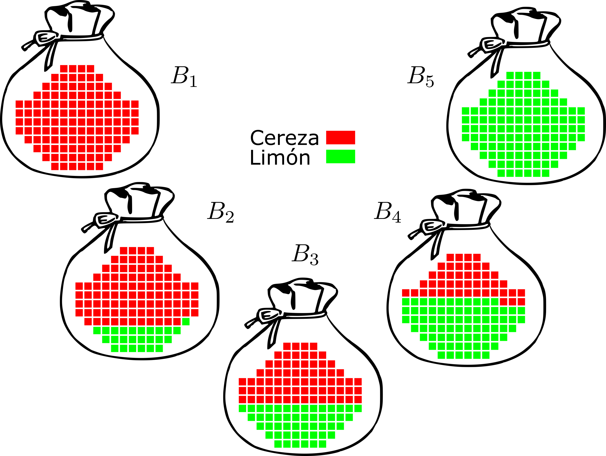

# Ejemplos: 1 dulces


### Ejemplo dulces en bolsas

{width=50%}

Tenemos cinco tipos de bolsas sin marcas particulares que contienen dulces de dos tipo: cereza y limón. En cada bolsa hay distinta proporción de cada uno de ellos:

|bolsa     | cereza |  limón |frecuencia |
|----------|--------|--------|-----------|
|$b_1$     |  100%  |   0%   |    0.1    |
|$b_2$     |   75%  |  25%   |    0.2    |
|$b_3$     |   50%  |  50%   |    0.4    |
|$b_4$     |   25%  |  75%   |    0.2    |
|$b_5$     |    0%  | 100%   |    0.1    |

Recibes de regalo una de estas bolsas ¿de qué tipo será?. De inicio y considerando que no te gustan los dulces de limón, piensas que ojalá tu bolsa sea del tipo $b_3$, notando que es el tipo más frecuente de bolsa. Finalmente, te enfrentas a la realidad y empiezas a examinarlos (es decir, obtienes datos de entrenamiento, $\textbf{d}$) y entonces tu hipótesis respecto del tipo de bolsa que es más probable que tengas se ajustará correspondientemente.

Cada tipo de bolsa tiene probabilidad de estar en tus manos según la siguiente expresión (_verosimilitud_:

$$
P(b_i|\textbf{d}) = \alpha P(\textbf{d}|b_i) P(b_i)
$$
Si nos preguntamos sobre la probabilidad de que el siguiente dulce que tome sea de limón sin saber el tipo de bolsa que tengo, necesito generar la distribución de probabilidades del asunto. Para calcular la distribucipón de probabilidad de una bolsa desconocida, dada la muestra de dulces que tenga, $\textbf{X}$, recurro a la siguiente expresión (_probabilidad total_):
$$
P(X|\textbf{d}) = \sum_{i} P(X|\textbf{d}, b_i) P(b_i|\textbf{d}) = \sum_{i} P(X|b_i)P(b_i|\textbf{d})
$$
Si las observacions $\textbf{d}$ son independientes, entonces

$$
P(\textbf{d}|b_i) = \prod_j P(d_j|b_i)
$$
Supongamos que los primeros 10 dulces que sacaste de la bolas fueron todos de limón. ¿Cómo afecta eso mi creencia inicial al pensar que la bolsa era de tipo $b_3$? Con el supuesto de que la bolsa es de tipo 3, las cantidades de los dos dulces es la misma, la probabilidad de cada tipo (suponiendo que no alteramos esas proporciones al sacarlos) es 0.5, y por tanto, la probabilidad de obtener una muestra de 10 dulces de limón condicionado a que tiene una bolsa tipo 3 es: $P(\textbf{d}|b_3) = 5^{10} \approx 0.001$.


```r
p_d_b3 <- 0.5^10
p_d_b3
```

```
## [1] 0.0009765625
```

Si hacemos esto mismo para distinto número de apariciones de dulces de limón en la muestra, obtenemos las siguientes gráficas.


Una función para calcular estas probabilidades.


```r
bayes_dulces <- function(n_muestra, n_limon, bolsas, prop_dulces)
{
    priors <- bolsas
    dulces_limon_hi <- prop_dulces
    verosimilitud_hi_n_limon <- dbinom(n_limon, n_muestra, dulces_limon_hi)
    total_p <- sum(priors * verosimilitud_hi_n_limon)
    posterior <- priors * verosimilitud_hi_n_limon / total_p
}
```

¿Qué tipo de bolsa puedo tener si tomo una muestra de 10 dulces y obtengo 8 dulces de limón?
 

 bolsa   posterior 
------- -----------
  b1         0     
  b2     0.001044  
  b3      0.2376   
  b4      0.7613   
  b5         0     

Table: Probabilidades _a posteriori_ para cada tipo de bolsa

